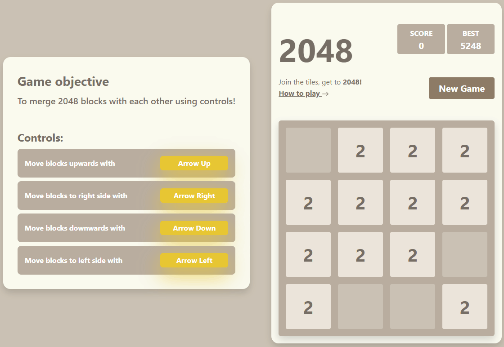

<h1 align="center">
    2048 Game
</h1>

  
  <a href="./preview" target="_blank">View more images or gifs!</a>

## Welcome!

## Access Project Online

This BIT course task is about creating 2048 game using JavaScript and bootstrap. Code is original and created by me!

-   [View](https://gymmed.github.io/BIT-2048-Game/)!

## Controls

Up Arrow - Shift cubes upwards. 
Right Arrow - Shift cubes to the right side. 
Down Arrow - Shift cubes downwards. 
Left Arrow - Shift cubes to the left side. 
